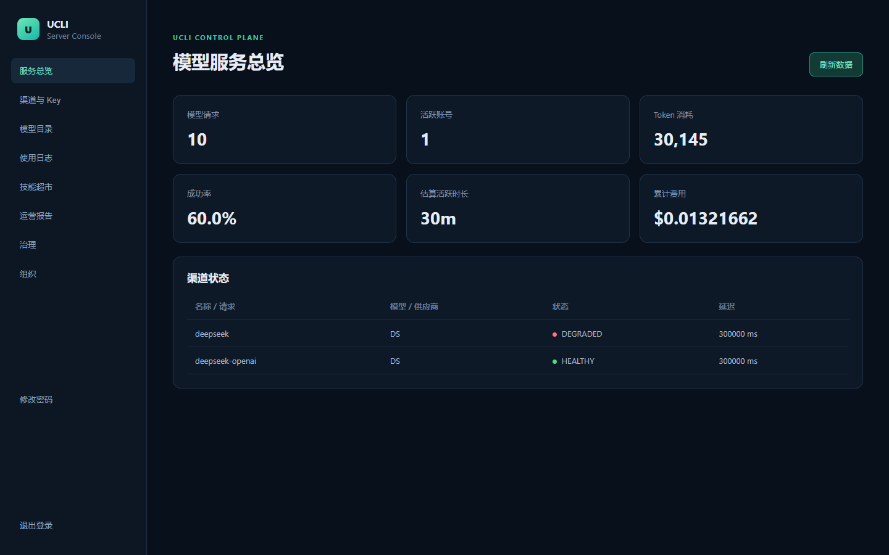
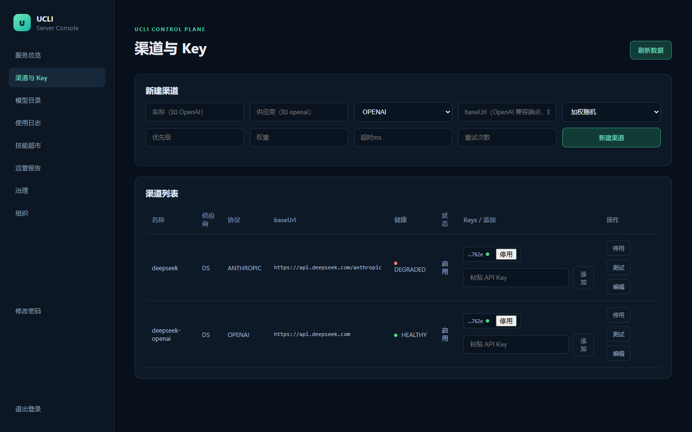
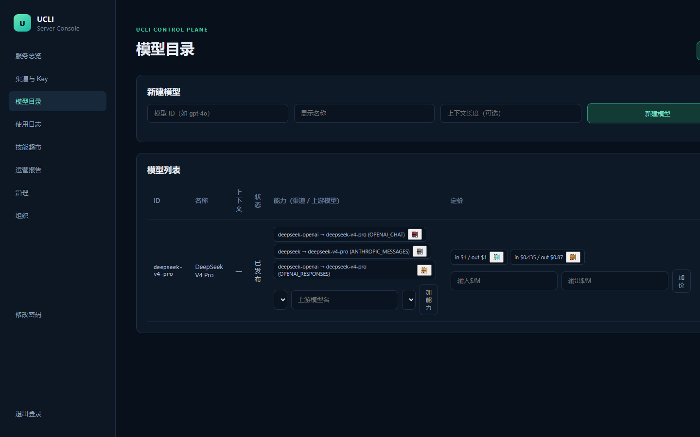
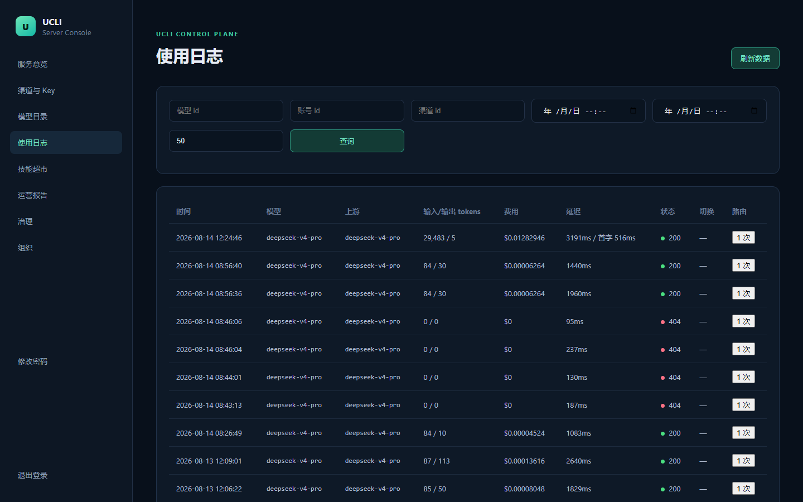
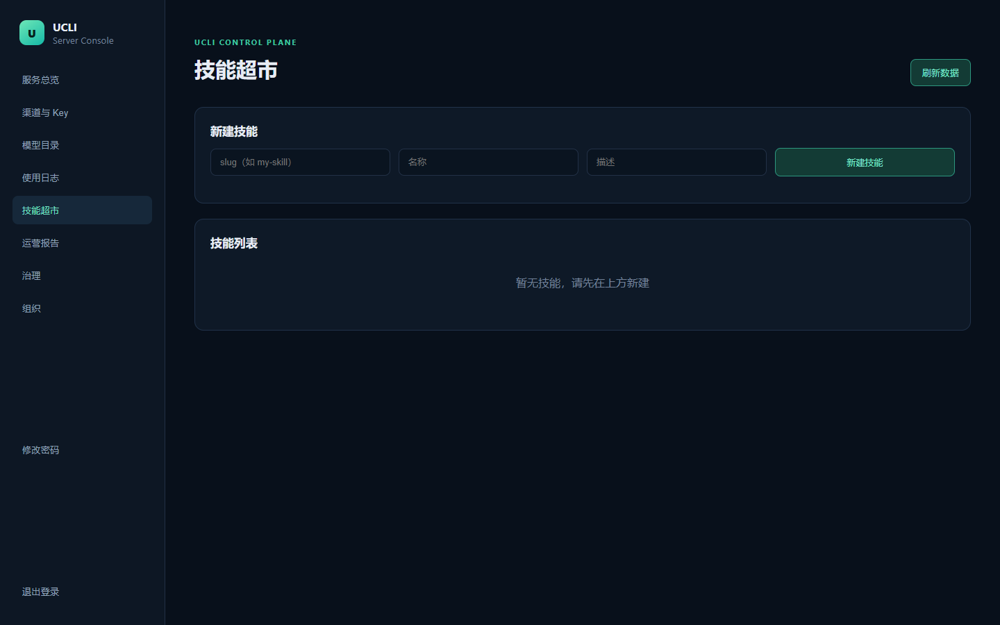
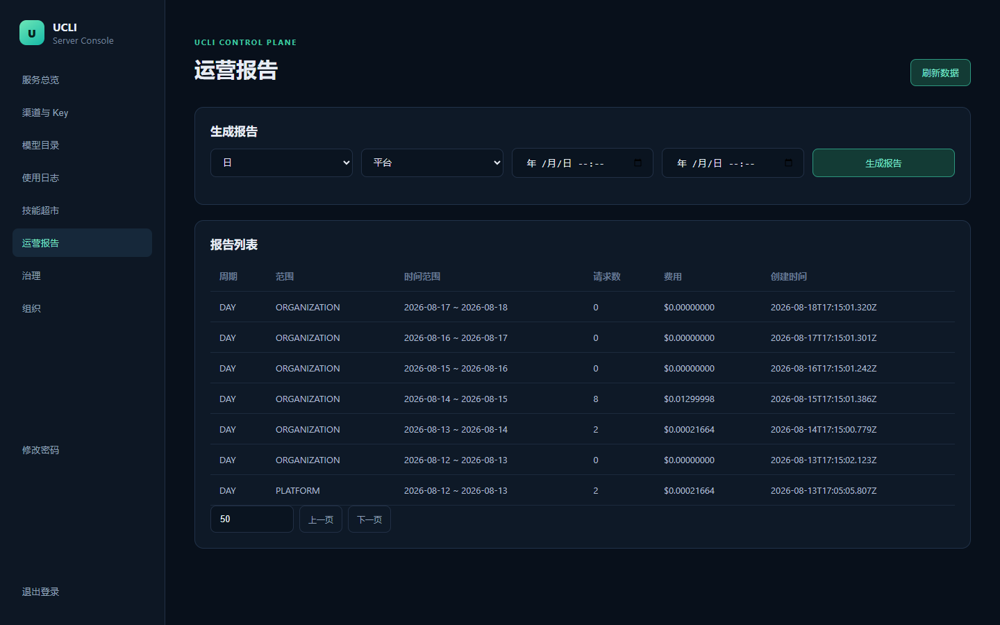
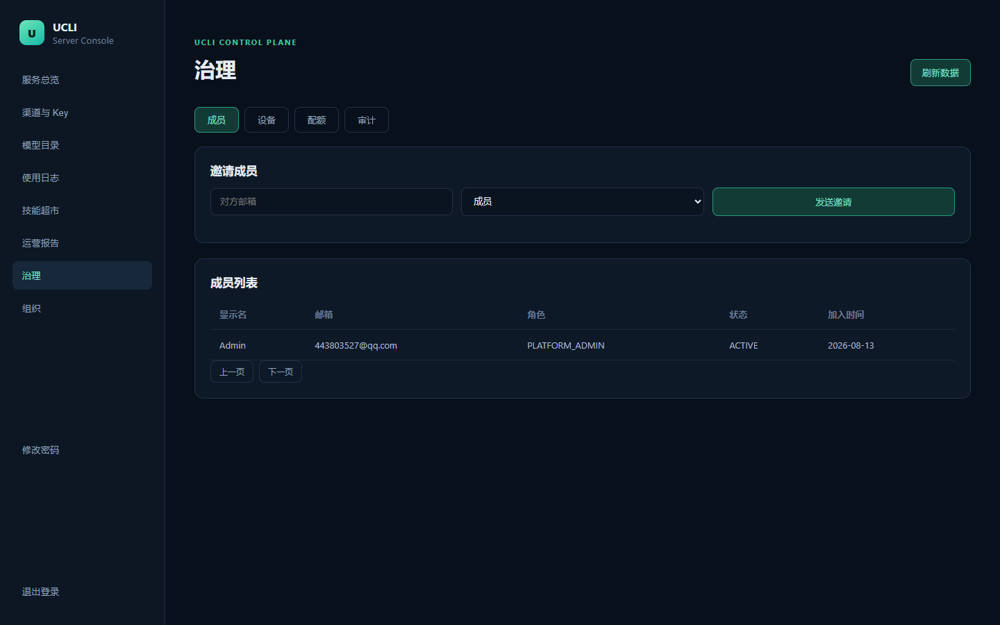
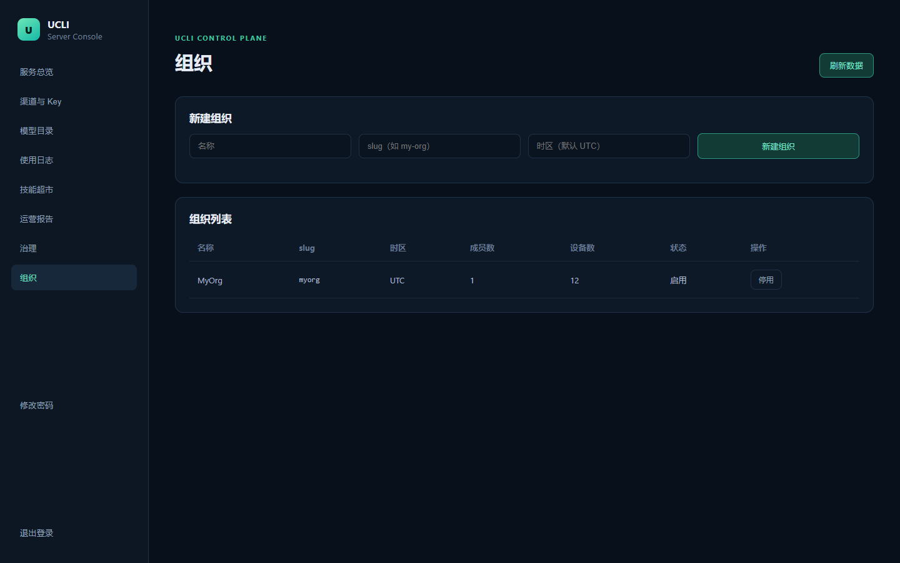
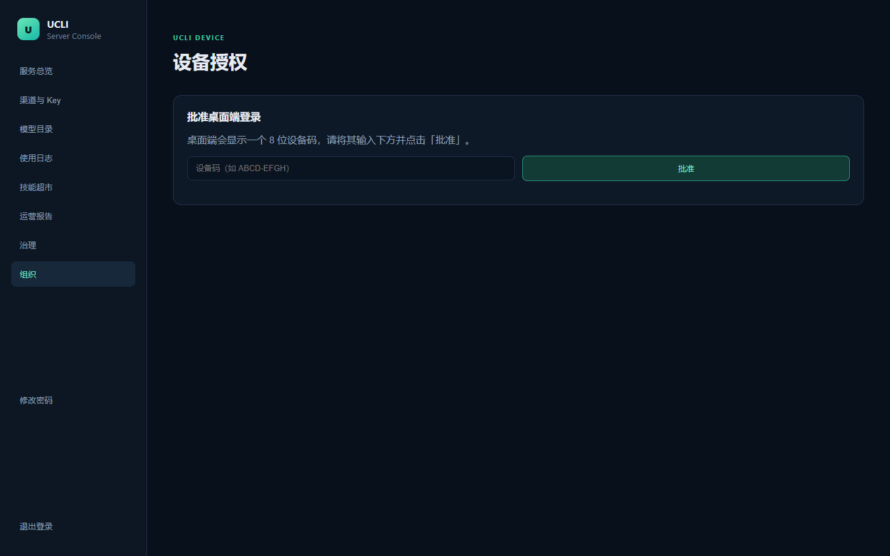
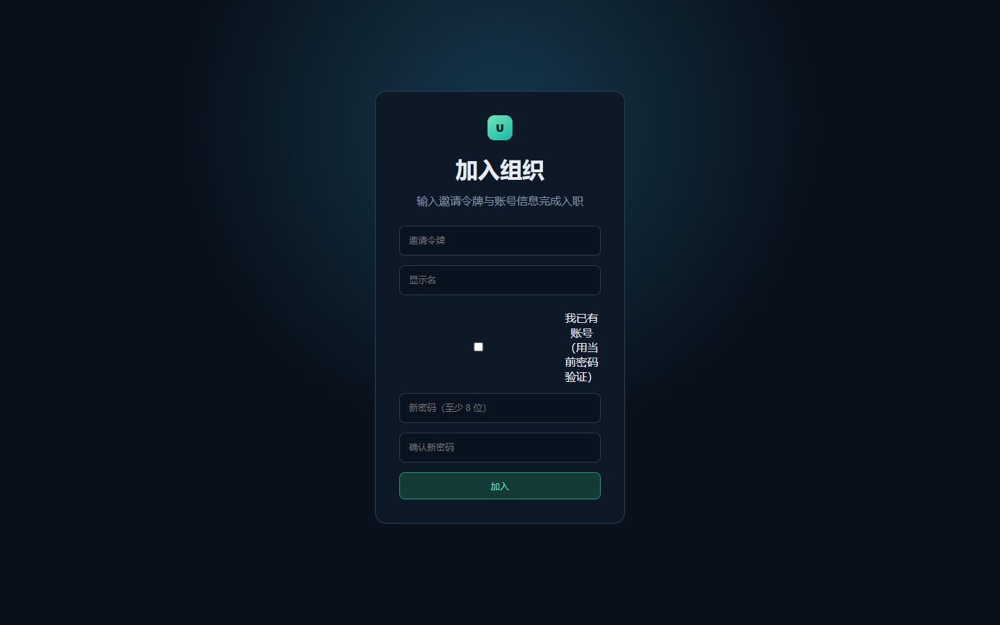

# UCLI Server 系统功能验收报告

> **历史记录已被后续设备授权方案取代：** 本文的邀请接受、设备码审批、治理页成员/设备描述仅反映 2026-08-20 的旧验收，不是当前产品契约。当前流程为“管理员预创建成员 → 创建设备授权 → 浏览器连接 UCLI”，以 `docs/ucli-client-protocol.md` 为准。

> 验收日期：2026-08-20
> 验收方式：playwright-cli 浏览器自动化 + 逐页截图
> 验收环境：本地 dev —— PostgreSQL/Redis/MinIO（Docker）、控制面 API `:3000`、模型网关 `:3001`、Worker（无 HTTP）、管理后台 `:5175`

## 一、验收范围

本次验收覆盖管理后台全部页面及两个对外授权页，共 11 个界面：

| 页面 | 路由 | 验收要点 |
| --- | --- | --- |
| 登录 | `/` | 邮箱 + 密码登录 |
| 服务总览 | `/` | 用量摘要卡片 + 渠道状态 |
| 渠道与 Key | `/channels` | 渠道增/改/启停/测试、Key 增/启停、路由配置（含 GEMINI） |
| 模型目录 | `/models` | 模型增/发布/下线、能力（含 GEMINI）、定价 |
| 使用日志 | `/usage` | 筛选、分页、路由尝试下钻 |
| 技能超市 | `/skills` | 技能增/版本上传/发布/撤销 |
| 运营报告 | `/reports` | 报告生成（scope 下拉）、分页 |
| 治理 | `/governance` | 成员/设备/配额/审计、配额增删、TPM、分页 |
| 组织 | `/organizations` | 组织增/启停 |
| 设备授权 | `/device` | 桌面端设备码批准 |
| 邀请接受 | `/invite` | 邀请令牌 + 设密码入职 |

## 二、验收结果

### 1. 登录
使用平台管理员邮箱 + 密码登录，成功后进入控制台（侧边导航 + 服务总览）。

结果：✅ 通过（登录成功，进入控制台）

### 2. 服务总览（Dashboard）
展示用量摘要卡片（模型请求、活跃账号、Token 消耗、成功率、估算活跃时长、累计费用）与渠道状态表。

结果：✅ 通过（摘要与渠道状态正常渲染）

### 3. 渠道与 Key
新建/编辑渠道（名称、供应商、协议、baseUrl、Key 选择策略、优先级、权重、超时、重试）、添加/启停 Key、渠道启停与连通性测试。协议下拉已含 **OPENAI / ANTHROPIC / GEMINI**，Key 选择策略含 **加权随机 / 轮询**。

结果：✅ 通过（GEMINI 协议与路由配置项可见）

### 4. 模型目录
新建模型、添加能力（渠道/上游模型/协议，含 GEMINI）、添加定价、发布/下线模型。

结果：✅ 通过

### 5. 使用日志
独立视图：按模型/账号/渠道/时间筛选，分页浏览，展开查看路由尝试（故障切换）明细。

结果：✅ 通过（筛选 + 分页 + 路由下钻）

### 6. 技能超市
新建技能、上传 ZIP 版本（扫描 + SHA-256）、发布/撤销版本。

结果：✅ 通过

### 7. 运营报告
按周期/范围（平台/组织/账号/模型/渠道，下拉选择）生成报告，列表分页浏览。

结果：✅ 通过（scope 下拉 + 分页）

### 8. 治理
成员（邀请/列表）、设备（撤销）、配额（增/删，含 TPM）、审计（日志截断展示）四个 tab；成员/设备分页。

结果：✅ 通过

### 9. 组织
新建组织、启停组织、成员/设备计数。

结果：✅ 通过

### 10. 设备授权页
桌面端登录的设备码批准入口（输入 8 位设备码 → 批准）。

结果：✅ 通过

### 11. 邀请接受页
新成员凭邀请令牌入职（令牌 + 显示名 + 设密码；已有账号可用当前密码验证）。

结果：✅ 通过

## 三、非功能验证（代码质量）

| 项 | 命令 | 结果 |
| --- | --- | --- |
| 类型检查 | `npm run typecheck` | ✅ 通过 |
| 单元/集成测试 + 覆盖率 | `npm run test:coverage` | ✅ 87.79% lines / 82.14% branches（门槛 80/75） |
| 后端构建 | `npm run build` | ✅ 通过 |
| 管理后台构建 | `npm run admin:build` | ✅ 通过（50 模块） |
| 依赖许可证 | `npm run licenses:check` | ✅ 通过（430 条） |
| 数据库迁移 | `npm run db:migrate` | ✅ 通过（含 Gemini 枚举迁移 `202608140001_gemini`） |
| 健康检查 | `GET /healthz` | ✅ `{postgres: ok, redis: ok}` |

## 四、结论

管理后台 11 个界面全部通过 playwright 截图验收，界面渲染正常；关键能力（Gemini 协议接入、通用 OpenAI 兼容、使用日志分页/下钻、配额治理、设备授权与邀请闭环）均已落地并可操作。非功能验证全绿，系统可进入交付/上线流程。

> 说明：截图位于 `docs/screenshots/`；playwright 原始快照/日志位于 `.playwright-cli/`（git 忽略）。
